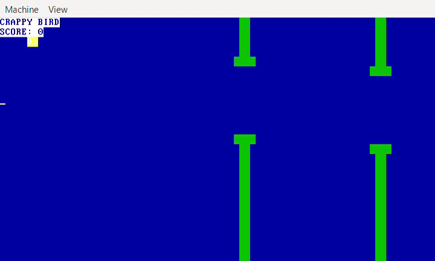

# Microkernel funcional com implementação de uma versão simplificada de Flappy Bird

Esse projeto usou como base o repositório [mkeykernel](https://github.com/arjun024/mkeykernel) para o desenvolvimento. Não assumo autoria de nenhuma parte do código exceto as adaptações e adições que fiz para a implementação do jogo. Projeto realizado apenas para fins educacionais.

## [Vídeo demonstração (Google Drive)](https://drive.google.com/file/d/16M8dyvrZuzEzGm3cN2T1A3zqSOROUeGT/view?usp=drivesdk)



## Entrega de Ponderada: Criando um kernel simples

O projeto inclui tanto os arquivos fonte do kernel (`kernel.asm`, `kernel.c`) quanto os binários pré-compilados (`kasm.o`, `kc.o`, `kernel`) e dependências (`keyboard_map.h`, `link.ld`) para uso em máquina real ou emulador. É apenas necessário o uso de um sistema com bootloader (GRUB ou similar) e selecionar o kernel para execução.

### Instruções de uso (Linux / WSL)

Para executar o kernel usando QEMU, apenas execute:

```
qemu-system-i386 -kernel kernel
```

Ou, se desejar reconstruir o kernel, instale as dependências NASM e GCC e execute o script `build.sh` para realizar esse processo automaticamente.

---

### Desenvolvimento

Esse projeto foi desenvolvido em cima de um microkernel em C já funcional com implementação de sistema de IDT para teclado. Para a lógica principal do jogo, foi implementada uma função de update por meio de um novo sistema IDT usando o chip PIT para chamar a função e esperar um intervalo continuamente. A tela é redesenhada constantemente para refletir as mudanças após a interrupção.

O jogo contém variáveis que acompanham a posição do pássaro e sua velocidade vertical atual, assim como a posição dos canos, que movem 1 caractere para esquerda a cada *tick* (intervalo de atualização do jogo). Quando a posição horizontal de um dos canos é igual à posição do jogador, o código checa se o pássaro está no espaço entre os canos, contando um ponto se estiver, e acabando o jogo caso contrário.

O jogador interage com o jogo utilizando as teclas de espaço, W ou ↑ para fazer o pássaro pular. O código do repositório original detectava quando uma tecla era pressionada e exibia ela na tela, mas essa lógica foi substituída para apenas detectar se uma tecla desejada foi pressionada, incrementando a velocidade vertical do pássaro quando isso acontecer. O arquivo cabeçalho `keyboard_map.h` também foi levemente alterado para que as teclas de jogo fossem mapeadas para o mesmo comando.

Funções auxiliares para a criação de strings para atributos VGA, movimentação do cursor para espaço determinado e de print para valores int também foram adicionados para tornar o código mais claro e limpo.
